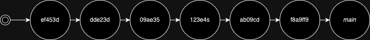
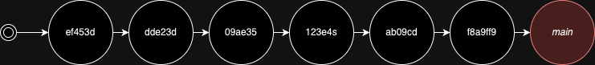
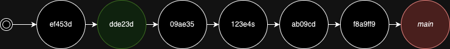
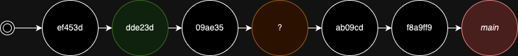
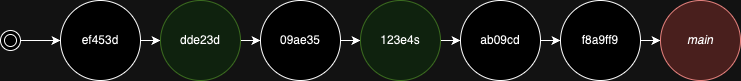
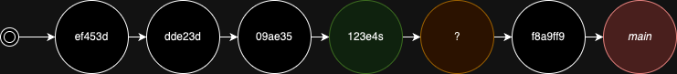
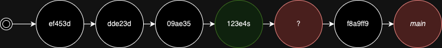
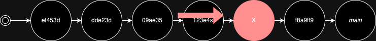

-----
theme: default
class: invert
-----

<!-- class: lead invert -->

# Git bisect

*A tool to find the commit that introduced a bug*


--------------
<!-- class: invert -->
# Start the bisect

```
> git bisect start
status: waiting for both good and bad commits
```

--------------
# Identify the known bad commit


```
> git bisect bad 
status: waiting for good commit, 1 bad commit known
```

--------------
# Identify the known good commit


```
> git bisect good dde23d

Bisecting: 2 revisions left to test after this (roughly 2 steps)
[123e4s] Some commit message
```

--------------

# Consider the commit in between



```
> git bisect good
...
```

--------------
# The "good" boundary will shift


```
> git bisect good
Bisecting: 1 revisions left to test after this (roughly 1 steps)
[ab09cd] Some other commit
```

--------------
# Next commit inbetween checked out



```
> git bisect bad
...
```
--------------
# The "bad" boundary will shift



```
> git bisect bad
...
```

--------------
# Bad commit found



```
> git bisect bad
ab09cd is the first bad commit
commit ab09cd (HEAD)
Author: Literally the devil <troll@lolol.com>
Date:   Wed Jun 19 17:37:57 2024 +0200

    Let's break some code!

 critical_file.ts | 1 +
 1 file changed, 1 insertion(+)

```
----------------

# Stop bisecting

```
> git bisect reset
Previous HEAD position was 2ae0f9a Last commit
Switched to branch 'main'
```

----------------

# Demo time!
